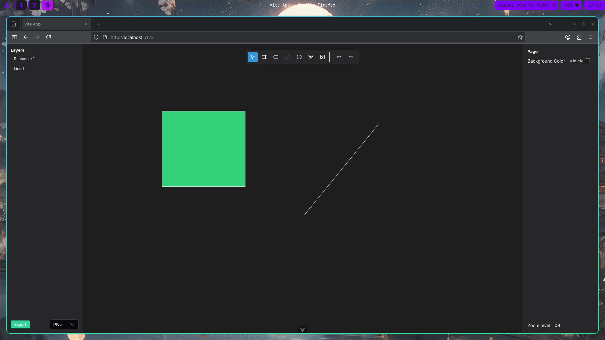

# 🖌️ Sketchvue

A small Figma-like app built with **Vue 3**.
This project was created as a learning experiment to understand and explore the **HTML5 Canvas API** and how to integrate it with **Vue 3's** reactivity system.

---

## 🚀 Features

- Draw basic shapes like rectangle, line, ellipse, frames, text on a canvas
- Select and move shapes
- Basic shape styling (color, stroke)

## 🎯 Purpose

The goal of this project was to:

- Learn how to use the **Canvas API** effectively
- Explore **Vue 3** Composition API and component structure
- Build an interactive UI with custom drawing functionality

## 🛠️ Tech Stack

- Vue 3 + Vite
- Scss + PrimeVue
- HTML5 Canvas

## 📸 Screenshot



## 📦 Getting Started

```shell
git clone https://github.com/hc-b666/uinity.git
cd uinity
npm install
npm run dev
```

## 📌 Notes

This is a learning project, not a production-ready tool.
Feel free to explore, fork, or suggest improvements!
